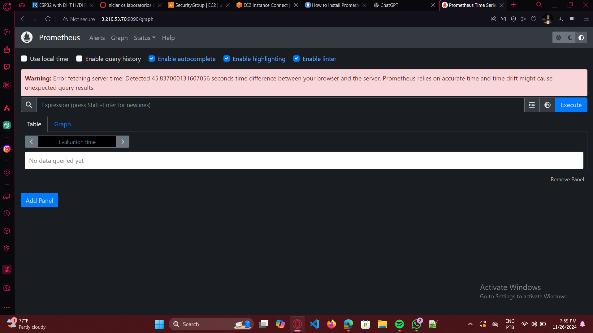
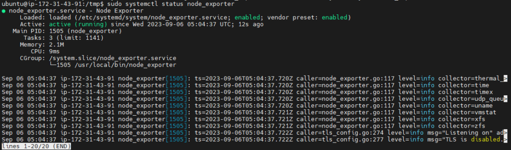
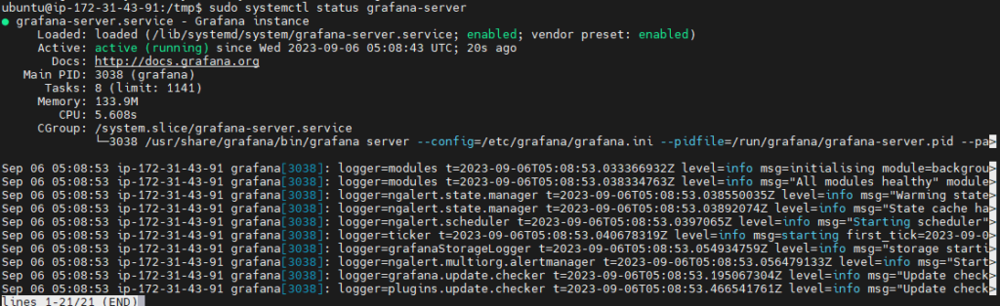
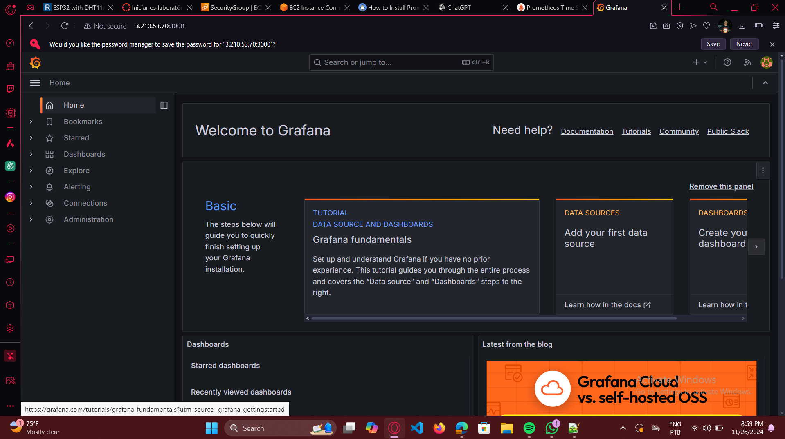
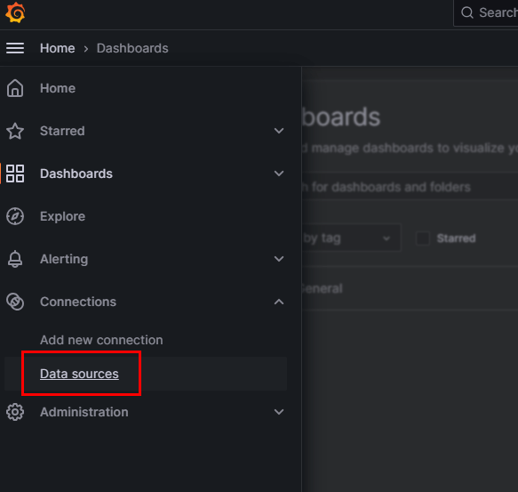
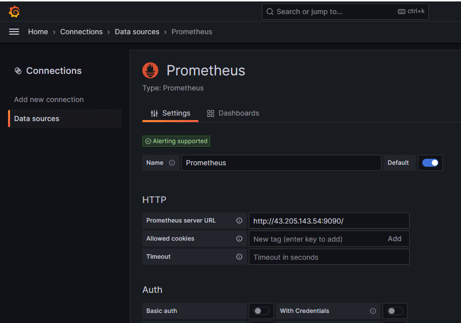

# Monitoramento com Prometheus e Grafana

Este projeto configura um sistema de monitoramento utilizando o **Prometheus** e **Grafana** e regras de alertas específicas para garantir a saúde e o desempenho adequado da infraestrutura do servidor. As métricas monitoradas incluem CPU, carga do sistema, memória, swap e espaço em disco.

## Visão Geral

O **Prometheus** é uma ferramenta de monitoramento e alerta open-source que coleta e armazena métricas em tempo real. Ele é amplamente utilizado para monitorar servidores, containers, e outras infraestruturas em tempo real. O Prometheus coleta dados de suas instâncias e, com base em regras configuradas, envia alertas para que os administradores de sistema possam agir proativamente.

### Componentes principais do sistema:
- **Prometheus**: Coleta e armazena as métricas.
- **Alertmanager**: Gerencia os alertas e os envia para canais como e-mail, Slack ou outras plataformas.
- **Node Exporter**: Exporta métricas de sistemas operacionais, como CPU, memória, disco e rede.
- **Grafana**: gera dashboards com base nas metricas armazenadas pelo Prometheus

## Como Funciona o Monitoramento

### Instalação e Configuração:

---

## Requisitos
- **Sistema operacional**: Ubuntu 22.04 LTS
- **Privilégios**: Acesso root ou um usuário com privilégios `sudo`
- **Conexão**: Necessário acesso à internet

---


## Passo 1: Instalar o Prometheus

1. **Atualizar pacotes**  
   ```bash
   sudo apt update -y
   ```
2. **Criar o usuário Prometheus**
    ```bash
   sudo useradd --no-create-home --shell /bin/false prometheus
   ```
3. **Criar diretórios de configuração e dados**

    ```bash
    sudo mkdir /etc/prometheus
    sudo mkdir /var/lib/prometheus
    sudo chown prometheus:prometheus /var/lib/prometheus
    ```
4. **Baixar e extrair o Prometheus**
    ```bash
    cd /tmp
    wget https://github.com/prometheus/prometheus/releases/download/v2.46.0/prometheus-2.46.0.linux-amd64.tar.gz
    tar -xvf prometheus-2.46.0.linux-amd64.tar.gz
    cd prometheus-2.46.0.linux-amd64    
    ```
5. **Mover arquivos de configuração e binários**

    ```bash
    sudo mv console* /etc/prometheus
    sudo mv prometheus.yml /etc/prometheus
    sudo chown -R prometheus:prometheus /etc/prometheus
    sudo mv prometheus /usr/local/bin/
    ```
6. **Configurar o serviço Prometheus**
Crie o arquivo de serviço com:

    ```bash 
    sudo nano /etc/systemd/system/prometheus.service
    ```
Cole o seguinte conteúdo no arquivo:

    ```bash
    [Unit]
    Description=Prometheus
    Wants=network-online.target
    After=network-online.target

    [Service]
    User=prometheus
    Group=prometheus
    Type=simple
    ExecStart=/usr/local/bin/prometheus \
        --config.file /etc/prometheus/prometheus.yml \
        --storage.tsdb.path /var/lib/prometheus/ \
        --web.console.templates=/etc/prometheus/consoles \
        --web.console.libraries=/etc/prometheus/console_libraries

    [Install]
    WantedBy=multi-user.target
    ```

7. **Salvar e ativar o serviço**

    ```bash
    sudo systemctl start prometheus
    sudo systemctl enable prometheus
    sudo systemctl status prometheus
    ```
    


8. **acessar no seu navegador**
http://<ip_da_maquina>:9090


## Passo 2: Instalar o Node Exporter
1. **Baixar e extrair o Node Exporter**  
   ```bash
    cd /tmp
    wget https://github.com/prometheus/node_exporter/releases/download/v1.6.1/node_exporter-1.6.1.linux-amd64.tar.gz
    sudo tar xvfz node_exporter-*.*-amd64.tar.gz
    sudo mv node_exporter-*.*-amd64/node_exporter /usr/local/bin/
   ```

2. **Criar o usuário Node Exporter**
    ```bash
    sudo useradd -rs /bin/false node_exporter    
    ```
3. **Configurar o serviço Node Exporter**
Crie o arquivo com:

    ```bash
    sudo nano /etc/systemd/system/node_exporter.service
    ```
Cole o seguinte conteúdo:

    ```bash
    [Unit]
    Description=Node Exporter
    After=network.target

    [Service]
    User=node_exporter
    Group=node_exporter
    Type=simple
    ExecStart=/usr/local/bin/node_exporter

    [Install]
    WantedBy=multi-user.target
    ```
4. **Salvar e ativar o serviço**

    ```bash
    sudo systemctl daemon-reload
    sudo systemctl start node_exporter
    sudo systemctl enable node_exporter
    sudo systemctl status node_exporter
    ```

    

5. **Adicionar o Node Exporter no Prometheus**
Edite o arquivo de configuração do Prometheus:

    ```bash
    sudo nano /etc/prometheus/prometheus.yml
    ```

    ```- job_name: 'Node_Exporter'
        scrape_interval: 5s
        static_configs:
            - targets: ['<ip_da_maquina>:9100']
    ```

6. **Reiniciar o Prometheus**
    ```bash
    sudo systemctl restart prometheus
    ```

## Passo 2: Instalar Grafana
1. **Adicionar o repositório Grafana**

    ```bash
    wget -q -O - https://packages.grafana.com/gpg.key | sudo apt-key add -
    sudo add-apt-repository "deb https://packages.grafana.com/oss/deb stable main"
    sudo apt update
    ```
2. **Instalar e ativar o Grafana**

    ```bash
    sudo apt install grafana -y
    sudo systemctl start grafana-server
    sudo systemctl enable grafana-server
    sudo systemctl status grafana-server
    ```
    

3. **Acessar o Grafana**

    ```bash
    http://<ip_da_maquina>:3000
    ```
    

    Usuário: admin
    Senha: admin

    

    No Grafana, clique em Add Data Source e selecione Prometheus.

    

    Insira a URL do Prometheus, por exemplo: http://<ip_da_maquina>:9090

        

    Clique em Save & Test para validar.

    Clique no ícone + no menu esquerdo e selecione Import.
    


    Use o ID 14513 para importar um dashboard do Grafana.com.
    

    Selecione o Prometheus como fonte de dados e clique em Import.

    Agora seu Dashboard está rodando!.
    

### Regras de Alerta:

- **Alertas de CPU**: Disparam quando o uso da CPU ultrapassa o limite de 90% por um tempo contínuo.
- **Alertas de Carga do Sistema**: Disparam quando a carga do sistema (número de processos que estão esperando para serem executados) atinge um nível insustentável.
- **Alertas de Memória**: Disparam quando a utilização da memória atinge ou ultrapassa 90%.
- **Alertas de Swap**: Disparam quando o uso de swap se torna excessivo, indicando que o sistema está ficando sem memória física.
- **Alertas de Espaço em Disco**: Disparam quando o uso do disco atinge um limite crítico, o que pode levar a falhas no sistema.

## Métricas Monitoradas

### 1. CPU
- **Métrica**: 
    ```prometheus
    avg(rate(node_cpu_seconds_total{mode="user"}[1m])) * 100
    ```
- **Descrição**: Monitora o tempo de CPU usado em modo "usuário", em relação ao tempo total de CPU disponível.
- **Thresholds**:
    - Safe: `avg(rate(node_cpu_seconds_total{mode="user"}[1m])) * 100 < 75`
    - Warning: `avg(rate(node_cpu_seconds_total{mode="user"}[1m])) * 100 >= 75 and < 90`
    - Alert: `avg(rate(node_cpu_seconds_total{mode="user"}[1m])) * 100 >= 90`
  
### 2. Carga do Sistema
- **Métrica**:
    - `node_load1`: Carga média do sistema nos últimos 1 minuto.
    - `node_load5`: Carga média do sistema nos últimos 5 minutos.
    - `node_load15`: Carga média do sistema nos últimos 15 minutos.
- **Thresholds**:
    - Safe: `node_load1 < 1 and node_load5 < 5 and node_load15 < 15`
    - Warning: `node_load1 >= 1 and node_load1 < 2`
    - Alert: `node_load1 >= 2 or node_load5 >= 10 or node_load15 >= 20`

### 3. Memória
- **Métrica**:
    ```prometheus
    (node_memory_MemTotal_bytes - node_memory_MemFree_bytes) / node_memory_MemTotal_bytes * 100
    ```
- **Descrição**: Mede a porcentagem de memória usada no sistema.
- **Thresholds**:
    - Safe: `< 75%`
    - Warning: `>= 75% and < 90%`
    - Alert: `>= 90%`

### 4. Swap
- **Métrica**:
    ```prometheus
    (node_memory_SwapTotal_bytes - node_memory_SwapFree_bytes) / node_memory_SwapTotal_bytes * 100
    ```
- **Descrição**: Mede a porcentagem de swap utilizada.
- **Thresholds**:
    - Safe: `< 25%`
    - Warning: `>= 25% and < 50%`
    - Alert: `>= 50%`

### 5. Espaço em Disco (Root)
- **Métrica**:
    ```prometheus
    (node_filesystem_size_bytes{mountpoint="/"} - node_filesystem_free_bytes{mountpoint="/"}) / node_filesystem_size_bytes{mountpoint="/"} * 100
    ```
- **Descrição**: Mede a porcentagem de uso do espaço em disco da partição root (/).
- **Thresholds**:
    - Safe: `< 75%`
    - Warning: `>= 75% and < 85%`
    - Alert: `>= 85%`

## Como Visualizar os Alertas no Prometheus

1. **Acesse a interface web do Prometheus**:
    - Abra o navegador e digite `http://<ip_do_servidor>:9090`.
    - Clique na aba **"Alerts"** para visualizar os alertas ativos.

2. **Alertmanager**:
    - Caso esteja configurado, o **Alertmanager** irá enviar notificações quando os alertas forem disparados. 
    - Você pode configurá-lo para enviar mensagens via e-mail, Slack, ou outras plataformas de notificação.

## Conclusão

A configuração de monitoramento com o **Prometheus** e as regras de alertas descritas são essenciais para garantir a saúde da infraestrutura de servidores. Monitorar o uso de CPU, memória, swap, carga do sistema e espaço em disco ajuda a identificar e resolver problemas antes que eles afetem a operação do sistema.

Se você estiver utilizando o **Alertmanager** corretamente, será possível receber notificações e agir de forma proativa para resolver os problemas. O objetivo do monitoramento é garantir que o sistema esteja funcionando de forma eficiente e que os administradores possam ser alertados sobre possíveis falhas antes que elas ocorram.
